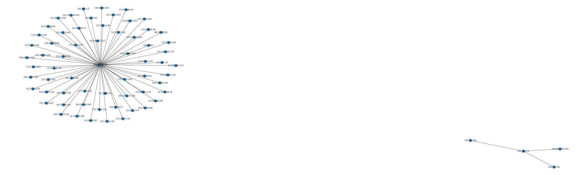

# simple-pcapng-visualizer
A simple way to visualize network traffic with pcapng file



# Requirement
- python3.x
- python-pcapng
- networkx
- matplotlib.pyplot

# Try it out
```
python3 simple-pcapng-visualizer.py packets.pcapng Graph
```
